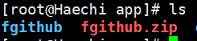
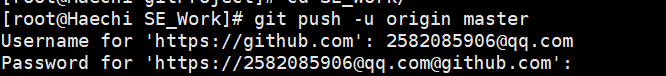
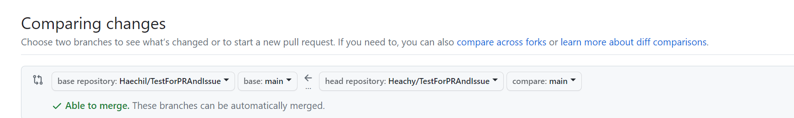
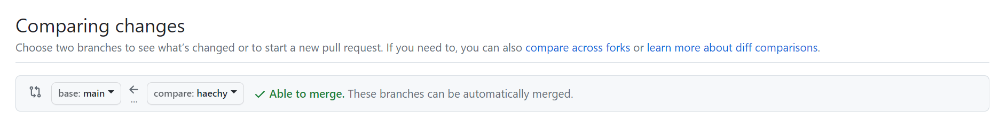
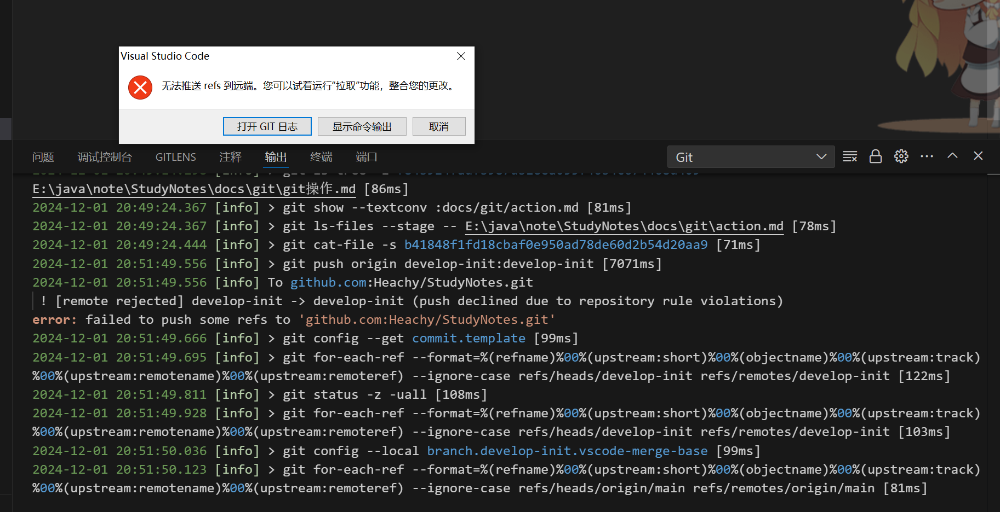

# Git操作


# clone指定分支

```shell
克隆远程某分支上的代码：git clone -b 分支名称 http://xxx.git
```


# pull 指定分支

```shell
# 指定远程仓库，并命名为origin
git remote add origin https://xxxx/tesgroup/smpgroup/cpgroup/dip/dip.git
# pull 的时候指定远程仓库和分支
git pull origin feature-master-xxx
```


# linux梯子

> 压缩包在本地的`E:\java\kit\linux梯子`中

```bash
yum install libicu    #先下载依赖包

wget -c https://github.com/dotnetcore/FastGithub/releases/download/2.0.4/fastgithub_linux-x64.zip    # 下载FastGithub
 
unzip fastgithub_linux-x64.zip    #解压

cd fastgithub_linux-x64    #进入到FastGithub文件夹下

./fastgithub    #运行FastGithub
```


- 启动

- `./fastgithub`

- 如果不能运行啥的，把对应文件的权限开起来

- 

- 进入到这个目录下

  

# 信息填写

- 

- username是邮箱

- password是token

- https://github.com/settings/tokens去这个那边生成个token去复制，选项全选

  gitub token:  xxsxsx

# 从0开始

基础配置

```shell
git config --global user.name Heachy
git config --global user.email 2582085906@qq.com
```

ssh里的config文件

应该大概是没毛病的

```json
Host github.com
HostName ssh.github.com
Port 443
User 2582085906@qq.com
PreferredAuthentications publickey
IdentityFile ~/.ssh/id_rsa
```

- ` ssh-keygen -t rsa -C "2582085906@qq.com"`
- 生成秘钥和公钥的，在ssh文件下打开git bash然后输入，并一直按回车即可
- ` ssh -T git@github.com` 
- 测试链接

```shell
git clone git@github.com:Heachy/PullRequest.git
```

- 克隆仓库

```shell
git pull
```

- 拉取并合并到本地仓库

```shell
git add .
# 碰到不允许访问文件的时候
# $ git add .
# fatal: detected dubious ownership in repository at 'E:/java/git/project/testForPr/TestForPRAndIssue'
# 把这个目录设置成安全目录

#  git config --global --add safe.directory E:/java/git/project/testForPr/TestForPRAndIssue

git commit -m '这次提交的备注'
git push -u origin master
```

- 先add所有更改，再commit到缓存，最后push到仓库

`git remote add origin 'git@github.com:Heachy/PullRequest.git'`

如果没有链接则添加一个这个

```shell
查看修改状态：git status
拉取远程仓库代码：git pull
克隆远程某分支上的代码：git clone -b 分支名称 http://xxx.git
合并分支到主分支：git merge 分支名称
创建新分支：git branch 新分支名
删除分支：git branch -D 分支名
查看分支：git branch
分支切换：git checkout 分支名称
查看记录：git log
查看地址：git remote -v
强制合并代码（用于当前版本和历史提交版本不一致的情况）：git pull origin 分支名--allow-unrelated-histories
本地代码覆盖远程分支代码：git push -f --set-upstream origin 分支名
```

- 如果想要上交一个本地项目到github上
  - 去github创建仓库
  - `git init` 初始化仓库
  - `git remote add origin git@github.com:Heachy/webdav-server.git` 绑定链接
  - `git pull origin main` 复制响应的东西
  - 接下来就是正常的git add . ,commit,push了

# PR



- 选择将自己fork仓库的哪一个分支提交到源仓库的哪一个分支



- 将某一个分支合并到另一个分支中

# Desktop

> 安装包和汉化的都放在E盘的迅雷下载里面了

**配置**

- 需要去将.ssh文件夹设置下权限
- 先： 右击->属性->安全->高级->禁用继承->删除全部继承
- 接着：只设置system和用户(Haechi Backer)权限即可
- 右击->属性->安全->高级->添加->选择主体->高级->立即查找  找到对应用户确定设置即可

# 错误bug

vscode中push时，发生以下情况

**无法推送refs到远端**



- 命令行报错

```bash
 ! [remote rejected] develop-init -> develop-init (push declined due to repository rule violations)
error: failed to push some refs to 'github.com:Heachy/StudyNotes.git'
```

原因，提交的更改中有不能提交的东西，比如什么秘钥，或者什么token之类的东西，需要检查