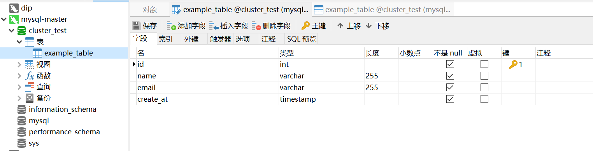

# Mysql集群

# 主从复制

> [参考博客](https://blog.csdn.net/qq_36037795/article/details/142907403)

## Docker部署

### 主节点

#### 启动容器

```bash
$ sudo docker run -p 3307:3306 \
 --name mysql-master \
 # 日志目录挂载
 -v /opt/mysqlmscluster/master/log:/var/log/mysql \
 # 数据文件目录挂载
 -v /opt/mysqlmscluster/master/data:/var/lib/mysql \
 # 配置目录挂载
 -v /opt/mysqlmscluster/master/conf:/etc/mysql/conf.d \
 # root密码设置
 -e MYSQL_ROOT_PASSWORD=root \
 -d mysql
```

#### 配置

```properties
$ vim /opt/mysqlmscluster/master/conf/my.cnf
[client]
default-character-set=utf8

[mysql]
default-character-set=utf8

[mysqld]
init_connect='SET collation_connection = utf8_unicode_ci'
init_connect='SET NAMES utf8'
character-set-server=utf8
collation-server=utf8_unicode_ci
skip-name-resolve


#Server的实例ID，必须全局唯一
server_id=1

# 开启binlog
log-bin=mysql-bin
#是否只读，主节点可以读写
read-only=0
#需要记录binlog的数据库
binlog-do-db=shibing_test
#忽略的数据库  就是创建mysql时附带的库
replicate-ignore-db=mysql
replicate-ignore-db=sys
replicate-ignore-db=information_schema
replicate-ignore-db=performance_schema
```

**重启主节点**`docker restart mysql-master`

#### 创建从节点访问用户

```bash
# 1. 进入docker容器内部
docker exec -it mysql-master /bin/bash

# 2. 进入mysql命令行  记得输入密码
mysql -h localhost -uroot -p -P3306

# 3. 创建用户
create user 'backup'@'%' identified by 'password';

# 4. 授权 复制权限
grant replication slave on *.* to 'backup'@'%';

# 5. 刷新权限
flush privileges;
```

这几个MySQL命令是在创建一个新的数据库用户并赋予其特定的权限。下面是每个命令的详细解释：

1. `create user 'backup'@'%' identified by 'passowrd';`
   这个命令创建了一个名为`backup`的新用户，该用户可以从任何主机（`'%'`表示任意主机）连接到MySQL服务器。密码被设置为`123456`。

2. `grant replication slave on *.* to 'backup'@'%';`
   这个命令给`backup`用户授予了复制从服务器（replication slave）的权限。这意味着`backup`用户可以访问所有数据库（`*.*`）的复制相关的操作。通常，这种权限用于MySQL复制架构中的从服务器，以便它们可以接收主服务器的二进制日志并应用更改。

3. `flush privileges;`
   这个命令重新加载授权表，使得之前创建用户和授予权限的更改立即生效。在MySQL中，更改权限或用户信息后，需要执行这个命令来确保更改被应用。

这些命令通常用于设置MySQL的主从复制环境，其中`backup`用户将用于从主数据库服务器复制数据到从服务器。需要注意的是，使用`'%'`作为主机允许任何IP地址连接，这可能会带来安全风险，因此在生产环境中应该使用具体的IP地址或IP范围来限制访问。

#### 查看主节点状态

这里注意在8.0以前的版本是`show master status`，后续版本改成了`show binary log status`；自8.0版本后master 和slave参数都有变化，slave基本上改成了replica。

#### 创建样例表



### 从节点

#### 启动容器

```bash
$ sudo docker run -d -p 3308:3306 \
 --name mysql-replica \
 -v /opt/mysqlmscluster/replica/log:/var/log/mysql \
 -v /opt/mysqlmscluster/replica/data:/var/lib/mysql \
 -v /opt/mysqlmscluster/replica/conf:/etc/mysql/conf.d \
 -e MYSQL_ROOT_PASSWORD=root \
# 关联主节点
 --link mysql-master:mysql-master \
 mysql
 
 
 #从节点容器启动
 $ sudo docker ps
CONTAINER ID   IMAGE          COMMAND                   CREATED        STATUS             PORTS                                                                        NAMES
fd9ecf27cfbc   mysql          "docker-entrypoint.s…"   6 hours ago    Up About an hour   33060/tcp, 0.0.0.0:3308->3306/tcp, [::]:3308->3306/tcp                       mysql-replica

```

#### 配置

```properties
$ vim /opt/mysqlmscluster/replica/conf/my.cnf
[client]
default-character-set=utf8

[mysql]
default-character-set=utf8

[mysqld]
init_connect='SET collation_connection = utf8_unicode_ci'
init_connect='SET NAMES utf8'
character-set-server=utf8
collation-server=utf8_unicode_ci
skip-name-resolve

server_id=2
# 这里从节点没有他自己的从节点(A->B->C这样的关系，B是A的从节点，同时是C的主节点），可以不开启binlog
log-bin=mysql-bin
# 从节点设为只读
read-only=1
binlog-do-db=shibing_test

replicate-ignore-db=mysql
replicate-ignore-db=sys
replicate-ignore-db=information_schema
replicate-ignore-db=performance_schema

```

**重启从节点**`docker restart mysql-replica`

#### 配置主节点信息

```bash
MySQL [(none)]> change replication source to source_host='mysql-master', 
source_user='backup', 
source_password='123456', 
source_log_file='mysql-bin.000001', 
source_log_pos=0, 
source_port=3306, 
get_source_public_key=1;


# 重启复制进程, mysql8以前的版本replica换成slave
MySQL [(none)]> stop replica; 
MySQL [(none)]> start replica;

```

- source_host: 主节点名称，这里直接用容器名称即可

- source_user，source_password：主节点创建的用户名密码，用户从节点复制日志使用，授予replication slave权限
- source_log_file：开始同步的binlog文件（初始从000001号文件开始）
- source_log_pos：开始同步的文件位置（初始从0开始）
- source_port：主机端口，我们是直接连接容器，使用容器开放的端口
- get_source_public_key： 获取master的公钥。mysql8 以后加密默认使用 caching_sha2_password 插件，需要添加 get_master_public_key=1 选项，8以下版本或者指定加密插件为 mysql_native_password 不需要加

#### 查看从节点状态

```bash
MySQL [performance_schema]> show replica status\G
*************************** 1. row ***************************
             Replica_IO_State: Waiting for source to send event
                  Source_Host: mysql-master
                  Source_User: backup
                  Source_Port: 3306
                Connect_Retry: 60
              Source_Log_File: mysql-bin.000006
          Read_Source_Log_Pos: 768
               Relay_Log_File: fd9ecf27cfbc-relay-bin.000007
                Relay_Log_Pos: 985
        Relay_Source_Log_File: mysql-bin.000006
           Replica_IO_Running: Yes
          Replica_SQL_Running: Yes
              Replicate_Do_DB: 
          Replicate_Ignore_DB: mysql,sys,information_schema,performance_schema
           Replicate_Do_Table: 
       Replicate_Ignore_Table: 
      Replicate_Wild_Do_Table: 
  Replicate_Wild_Ignore_Table: 
                   Last_Errno: 0
                   Last_Error: 
                 Skip_Counter: 0
          Exec_Source_Log_Pos: 768
              Relay_Log_Space: 1420
              Until_Condition: None
               Until_Log_File: 
                Until_Log_Pos: 0
           Source_SSL_Allowed: No
           Source_SSL_CA_File: 
           Source_SSL_CA_Path: 
              Source_SSL_Cert: 
            Source_SSL_Cipher: 
               Source_SSL_Key: 
        Seconds_Behind_Source: 0
Source_SSL_Verify_Server_Cert: No
                Last_IO_Errno: 0
                Last_IO_Error: 
               Last_SQL_Errno: 0
               Last_SQL_Error: 
  Replicate_Ignore_Server_Ids: 
             Source_Server_Id: 1
                  Source_UUID: 62573dca-88ce-11ef-a9fd-0242ac110005
             Source_Info_File: mysql.slave_master_info
                    SQL_Delay: 0
          SQL_Remaining_Delay: NULL
    Replica_SQL_Running_State: Replica has read all relay log; waiting for more updates
           Source_Retry_Count: 10
                  Source_Bind: 
      Last_IO_Error_Timestamp: 
     Last_SQL_Error_Timestamp: 
               Source_SSL_Crl: 
           Source_SSL_Crlpath: 
           Retrieved_Gtid_Set: 
            Executed_Gtid_Set: 
                Auto_Position: 0
         Replicate_Rewrite_DB: 
                 Channel_Name: 
           Source_TLS_Version: 
       Source_public_key_path: public_key.pem
        Get_Source_public_key: 1
            Network_Namespace: 
1 row in set (0.003 sec)

```

### 从节点切换主节点

```bash
# 1. 进入到从节点的mysql命令行
# 先停止原先的复制进程
stop replica;

# 2. 清除replica配置信息
reset replica all;

# 3. 清除访问用户
DROP USER 'backup'@'%';

# 4. 重新配置
# 指令看上文 什么change replication source的

# 5. 重新启动
start replica;

# 6. 查看详情 
# 确保 Replica_IO_Running: Yes
#     Replica_SQL_Running: Yes

show replica status\G;
```

