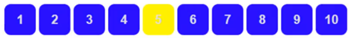

# CSS样式

# 导入方式

创建样式表 -> Stylesheet -> style.css
用链接将二者连接。

## 行内样式
```html
<!-- 在标签元素中，编写一个style属性，编写样式即可 -->
<h1 style="color: red;">我是标题</h1>
```

## 偷懒写法

### 链接式

```html
<!-- 外部样式 -->
<link rel="stylesheet" href="css/style.css">
```

### 导入式

`@import` 是CSS 2.1 特有的！

```html
<!-- 导入式 -->
<style>
  @import url("css/style.css");
</style>
```

# 选择器

作用：选择页面上的某一个或者某一类元素

## 基本选择器

1. 标签选择器：选择一类标签 `标签{}`
2. 类选择器 `class`：选择所有class属性一致的标签，跨标签 `.类名{}`
3. Id选择器：全局唯一 `#id名`

```css
/* id选择器：id必须保证全局唯一! */
#id名称 {
  color: #ff008a;
}

.style1 {
  color: #02ff00;
}

h1 {
  color: #2d1dc1;
}
```

优先级：`id > class > 标签`

## 后代选择器

```css
/* 后代选择器 */
body p {
  background: red;
}
```

## 子选择器

```css
/* 子选择器 */
body > p {
  background: #3cbda6;
}
```

## 相邻兄弟选择器

```css
/* 相邻兄弟选择器：只有一个，相邻（向下） */
.active + p {
  background: #a13d30;
}
```

## 通用选择器

```css
/* 通用兄弟选择器，当前选中元素的向下的所有兄弟元素 */
.active ~ p {
  background: #02ff00;
}
```

后代：就是这个 `body` 下的所有 `p` 标签
 子代：就是 `body` 的下一层相邻的 `p` 标签
 相邻兄弟选择：选择的标签的下一个 `p` 标签
 通用：选择的标签的下面所有 `p` 标签

## 伪类选择器

```html
<body>
  <p>p0</p>
  <p class="active">p1</p>
  <p>p2</p>
  <p>p3</p>
  <ul>
    <li>
      <p>p4</p>
    </li>
    <li>
      <p>p5</p>
    </li>
    <li>
      <p>p6</p>
    </li>
  </ul>
</body>
```

```css
/* ul的第一个子元素 */
ul li:first-child {
  background: #02ff00;
}

/* ul的最后一子元素 */
ul li:last-child {
  background: #ff4832;
}

/* 选中 p1：定位到父元素，选择当前的第一个元素 */
/* 选择当前p元素的父级元素，选中父级元素的第一个，并且是当前元素才生效!，顺序 */
p:nth-child(2) {
  background: #2700ff;
}

/* 选中父元素，下的p元素的第二个，类型 */
p:nth-of-type(1) {
  background: yellow;
}
```

## 属性选择器

> 属性选择器，很直接简便

```css
/*
属性名，
属性名=属性值(正则)
= 绝对等于
*= 包含这个元素
^= 以这个开头
$= 以这个结尾
*/

/* 存在id属性的元素 */
a[id] {
  /*background: yellow;*/
}

/* id=first的元素 */
a[id=first] {
  /*background: #63ff23;*/
}

/* class中有 links的元素 */
a[class*="links"] {
  /*background: yellow;*/
}

/* 选中href中以http开头的元素 */
a[href^="http"] {
  /*background: yellow;*/
}
```

### CSS 鼠标悬停效果

```css
a:hover{
  background: #000b3e;
}
/* 这个是将鼠标移到上面后会显示背景色 */
```


```html
<style>
.demo a {
  float: left;
  display: block;
  height: 50px;
  width: 50px;
  border-radius: 10px;
  background: #2700ff;
  text-align: center;
  color: gainsboro;
  text-decoration: none;
  margin-right: 5px;
  font: bold 20px/50px Arial;
}
</style>
```

```html
<p class="demo">
  <a href="http://www.baidu.com" class="links item first" id="first">1</a>
  <a href="http://blog.kuangstudy.com" class="links item active" target="_blank" title="test">2</a>
  <a href="images/123.html" class="links item">3</a>
  <a href="images/123.png" class="links item">4</a>
  <a href="images/123.jpg" class="links item">5</a>
  <a href="abc" class="links item">6</a>
  <a href="/a.pdf" class="links item">7</a>
  <a href="/abc.pdf" class="links item">8</a>
  <a href="abc.doc" class="links item">9</a>
  <a href="abcd.doc" class="links item last">10</a>
</p>
```

### 效果图



# 字体样式

```css
<!--
font-family: 字体
font-size: 字体大小
font-weight: 字体粗细
color : 字体颜色
-->
<style>
body {
  font-family: "Arial Black", 楷体;
  color: #a13d30;
}

h1 {
  font-size: 50px;
}

.p1 {
  font-weight: bolder;
}
</style>
```

设置字体，美化的开端

**span标签**: 重点要突出的字，使用 `span` 标签套起来。