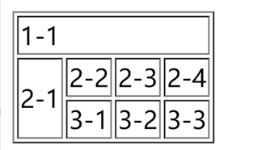
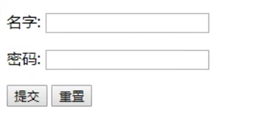
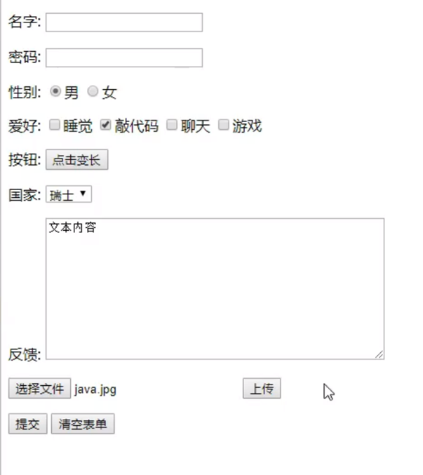
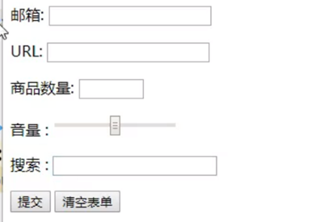

# Html

#  `<a>` 标签使用示例

> a标签
> href：必填，表示要跳转到那个页面
> target：表示窗口在哪里打开

- `_blank` 在新标签中打开
- `_self` 在自己的网页中打开

## 示例代码

```html
<a href="1.我的第一个网页.html" target="_blank">点击我跳转到页面一</a>
<a href="https://www.baidu.com" target="_self">点击我跳转到百度</a>

<br>

<a href="1.我的第一个网页.html">
  
</a>
```

## 解释

- `<a href="1.我的第一个网页.html" target="_blank">点击我跳转到页面一</a>`：创建一个链接，点击后会在新标签页打开 "1.我的第一个网页.html"。
- `<a href="https://www.baidu.com" target="_self">点击我跳转到百度</a>`：创建一个链接，点击后会在当前页面打开百度。
- ``：在链接旁边显示一个图片，图片路径为 `../resources/image/1.jpg`，图片的替代文本为 "狂神头像"，悬停文字为 "悬停文字"，图片宽度为 300px，高度为 300px。

# 表格

## HTML 表格示例

```html
<table border="1px">
  <tr>
    <!-- 跨列 -->
    <td colspan="4">1-1</td>
  </tr>
  <tr>
    <!-- 跨行 -->
    <td rowspan="2">2-1</td>
    <td>2-2</td>
    <td>2-3</td>
    <td>2-4</td>
  </tr>
  <tr>
    <td>3-1</td>
    <td>3-2</td>
    <td>3-3</td>
  </tr>
</table>
```

## 解释

- `<table border="1px">`：创建一个带有1像素边框的表格。
- `<tr>`：表示表格中的一行。
- `<td>`：表示表格中的一个单元格。
- `colspan="4"`：表示单元格跨越4列。
- `rowspan="2"`：表示单元格跨越2行



# HTML 表单示例

```html
<form action="1.我的第一个网页.html" method="post">
  <!-- 文本输入框：input type="text" -->
  <p>名字：<input type="text" name="username"></p>
  <!-- 密码框：input type="password" -->
  <p>密码：<input type="password" name="pwd"></p>
  <input type="submit">
  <input type="reset">
</form>
```



## 单选框 (Radio Buttons)

```html
<p>性别:</p>
<input type="radio" value="boy" name="sex">男
<input type="radio" value="girl" name="sex">女

<input type="submit">
```

### 多选框 (Checkboxes)

```html
<p>爱好:</p>
<input type="checkbox" value="sleep" name="hobby">睡觉
<input type="checkbox" value="code" name="hobby">敲代码
<input type="checkbox" value="chat" name="hobby">聊天
<input type="checkbox" value="game" name="hobby">游戏
```

### 按钮 (Buttons)

| 输入类型 | 描述     |
| :------- | :------- |
| `button` | 普通按钮 |
| `image`  | 图像按钮 |
| `submit` | 提交按钮 |
| `reset`  | 重置按钮 |

```html
<p>按钮:</p>
<input type="button" name="btn1" value="点击变长">
<input type="image" src="../resources/image/1.jpg">
<input type="submit">
<input type="reset" value="清空表单">
```

## 下拉框 (Select Box)

```markdown
<p>国家:</p>
<select name="国家列表">
  <option value="china">中国</option>
  <option value="us">美国</option>
  <option value="eth" selected>瑞士</option>
  <option value="india">印度</option>
</select>
```

- `select` 标签用于创建下拉框，`option` 标签定义下拉框中的选项。
- `value` 属性指定选项的值。
- `selected` 属性表示默认选中的选项。

## 文本域 (Textarea)

```html
<textarea name="反馈" cols="50" rows="10">文本内容</textarea>
```

- `textarea` 标签用于创建多行文本输入框。
- `cols` 属性定义文本域的宽度。
- `rows` 属性定义文本域的高度。

## 文件域 (File Input)

```html
<input type="file" name="files">
<input type="button" value="上传" name="upload">
```

- `input type="file"` 用于创建文件上传域。
- `input type="button"` 用于创建按钮，与文件上传域配合使用。




## 邮件验证

```html
<p>邮箱: <input type="email" name="email"></p>
```

### URL 输入

```html
<p>URL: <input type="url" name="url"></p>
```

### 数字输入

```html
<p>商品数量: <input type="number" name="num" max="100" min="0" step="1"></p>
```

### 滑块 (Range Input)

```html
<p>音量: <input type="range" name="voice" min="0" max="100" step="2"></p>
```

### 搜索框 (Search Input)

```html
<p>搜索: <input type="search" name="search"></p>
```

