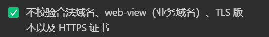

# Taro框架


# 文件path

需要在config/index.js中增加别名

```js
import path from 'path'//记得导入
const baseConfig = { // baseConfig本来就有，在这里头添加即可
    alias: {
      '@/components': path.resolve(__dirname, "..", "src/components"),
      "@/api": path.resolve(__dirname, "..", "src/api"),
      "@/assets": path.resolve(__dirname, "..", "src/assets"),
    }
}

//接下来就可以使用@/api
import storeDetailApi from "@/api/storeApi/storeDetail";
```

# 使用h5标签

需要导入`npm i @tarojs/plugin-html`

同样也是在`config/index.js`下的`baseConfig`中找到`plugins`选项，添加插件即可

```js
plugins: ['@tarojs/plugin-html']
```

# axios部分

## 注意项

- 不能使用alert去弹窗，需要使用`taro.showtoast`
- 不能使用localstorage需使用`wx.getStorageSync`

## 配置

- 需要额外导入`npm i axios-taro-adapter`

- 以及在使用axios的地方就是config.js中导入

  ```javascript
  import { TaroAdapter } from "axios-taro-adapter";
  
  //下面创建axios是配置适配器
  axios.create({
    //baseURL: 'https://rrewuq.com',
    baseURL: 'http://localhost:9737',
    timeout: 60000,
    adapter: TaroAdapter,  //适配器
    /*   withCredentials:true, */
    /* crossDomain:true, */
    headers: {
      'Content-Type': 'application/json; charset=utf-8'
    }
  })
  ```

- 小程序中需要关闭检测路由，在访问本地项目时

  