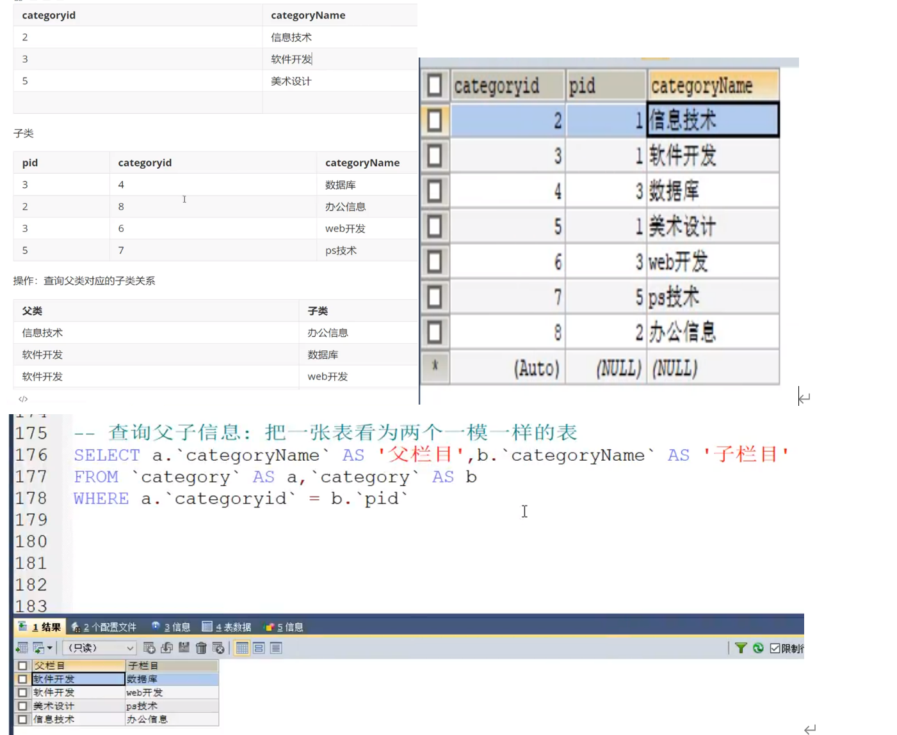

# SQL语句编写

> 先对环境进行搭建，安装mysql，使用sqlyong或者Navicat去进行数据库链接，并可视化的进行操作
>
> 创建数据库时，引擎选用InnoDB，字符集一般使用utf-8，并配合对应的排序规则，比如utf8_general_ci

# 数据库操作基本命令

## 创建数据库
```sql
CREATE DATABASE IF NOT EXISTS westos;
```

- 创建一个名为 `westos` 的数据库，如果不存在的话。

## 删除数据库

```sql
DROP DATABASE IF EXISTS westos;
```

- 删除名为 `westos` 的数据库，如果存在的话。

## 使用数据库

```sql
USE `school`;
```

- 使用名为 `school` 的数据库。如果数据库名或表名是特殊字符，需要使用反引号 ``` 括起来。

## 查看数据库

```sql
SHOW DATABASES;
```

- 显示当前服务器上所有的数据库。

# 数据库的列类型

## 数值类型

- **tinyint**: 十分小的数据，1个字节
- **smallint**: 较小的数据，2个字节
- **mediumint**: 中等大小的数据，3个字节
- **int**: 标准的整数，4个字节，常用的 `int`
- **bigint**: 较大的数据，8个字节
- **float**: 浮点数，4个字节
- **double**: 浮点数，8个字节（注意精度问题）
- **decimal**: 字符串形式的浮点数，金融计算时一般使用 `decimal`

## 字符串类型

- **char**: 字符串固定大小的，0~255
- **varchar**: 可变字符串，0~65535，常用的变量 `String`
- **tinytext**: 微型文本，\(2^8 - 1\)
- **text**: 文本串，\(2^{16} - 1\)，保存大文本

## 时间和日期类型

- **date**: `YYYY-MM-DD`，日期格式
- **time**: `HH:mm:ss`，时间格式
- **datetime**: `YYYY-MM-DD HH:mm:ss`，最常用的时间格式
- **timestamp**: 时间戳，从1970年1月1日到现在的毫秒数，也较为常用
- **year**: 年份表示

## 空值

- **null**: 没有值，未知
- 注意：不要使用 `NULL` 进行运算，结果为 `NULL`

# 数据库列的属性

## Unsigned
- 无符号的整数
- 声明了该列不能声明为负数

## Zerofill
- 0填充的
- 不足的位数，使用0来填充，例如：`int(3)`，数字5会被填充为005

## 自增 (Auto Increment)
- 通常理解为自增，自动在上一条记录的基础上加1（默认）
- 通常用来设计唯一的主键（index），必须是整数类型
- 可以自定义设计主键自增的起始值和步长

## 非空 (NOT NULL)
- 如果设置为 `NOT NULL`，如果不给它赋值，就会报错
- 如果不填写值，默认就是 `NULL`

## 默认值 (DEFAULT)
- 设置默认的值

# MySQL 数据库表操作

## 创建表
```sql
CREATE TABLE IF NOT EXISTS `student` (
  `id` INT(4) NOT NULL AUTO_INCREMENT COMMENT '学号',
  `name` VARCHAR(30) NOT NULL DEFAULT '匿名' COMMENT '姓名',
  `pwd` VARCHAR(20) NOT NULL DEFAULT '123456' COMMENT '密码',
  `sex` VARCHAR(2) NOT NULL DEFAULT '女' COMMENT '性别',
  `birthday` DATETIME DEFAULT NULL COMMENT '出生日期',
  `address` VARCHAR(100) DEFAULT NULL COMMENT '家庭住址',
  `email` VARCHAR(50) DEFAULT NULL COMMENT '邮箱',
  PRIMARY KEY (`id`)
) ENGINE=INNODB DEFAULT CHARSET=utf8;
```

- 学号 `int` 登录密码 `varchar(20)` 姓名，性别 `varchar(2)`，出生日期 `datetime`，家庭住址，邮箱

## 修改表名

```sql
ALTER TABLE teacher RENAME AS teacher1;
```

## 增加表的字段

```sql
ALTER TABLE teacher1 ADD age INT(11);
```

## 修改表的字段

```sql
ALTER TABLE teacher1 MODIFY age VARCHAR(11); -- 修改约束
ALTER TABLE teacher1 CHANGE age age1 INT(1); -- 字段重命名
```

## 删除表的字段

```sql
ALTER TABLE teacher1 DROP age1;
```

## 删除表

```sql
DROP TABLE IF EXISTS teacher1;
```

- 所有的创建和删除操作尽量加上判断，以免报错

## 定义外键

```sql
ALTER TABLE `student`
ADD CONSTRAINT `FK_gradeid` FOREIGN KEY (`gradeid`) REFERENCES `grade` (`gradeid`);
```

- 学生表的 `gradeid` 字段要去引用年级表的 `gradeid`

## 创建表时添加外键约束

```sql
CREATE TABLE IF NOT EXISTS `student` (
  `id` INT(4) NOT NULL AUTO_INCREMENT COMMENT '学号',
  `name` VARCHAR(30) NOT NULL DEFAULT '匿名' COMMENT '姓名',
  `pwd` VARCHAR(20) NOT NULL DEFAULT '123456' COMMENT '密码',
  `sex` VARCHAR(2) NOT NULL DEFAULT '女' COMMENT '性别',
  `birthday` DATETIME DEFAULT NULL COMMENT '出生日期',
  `gradeid` INT(10) NOT NULL COMMENT '学生的年级',
  `address` VARCHAR(100) DEFAULT NULL COMMENT '家庭住址',
  `email` VARCHAR(50) DEFAULT NULL COMMENT '邮箱',
  PRIMARY KEY (`id`),
  KEY `FK_gradeid` (`gradeid`),
  CONSTRAINT `FK_gradeid` FOREIGN KEY (`gradeid`) REFERENCES `grade` (`gradeid`)
) ENGINE=INNODB DEFAULT CHARSET=utf8;
```

# MySQL 数据库操作

## Insert（插入）

### 插入语句（添加）
```sql
-- 插入语句
INSERT INTO `grade` (`gradename`) VALUES ('大四');

-- 由于主键自增我们可以省略（如果不写表的字段，他就会一一匹配）
INSERT INTO `grade` VALUES ('大三');

-- 一般写插入语句，我们一定要数据和字段一一对应！
```

### 插入多个字段

```sql
INSERT INTO `grade` (`gradename`) VALUES ('大二'), ('大一');

INSERT INTO `student` (`name`) VALUES ('张三');

INSERT INTO `student` (`name`, `pwd`, `sex`) VALUES ('张三', 'aaaaaa', '男');

INSERT INTO `student` (`name`, `pwd`, `sex`) VALUES ('李四', 'aaaaa', '男'), ('王五', 'aaaaa', '男');
```

## Update（更新）

### 修改数据

```sql
-- 修改学员名字，带了简介
UPDATE `student` SET `name`='狂神' WHERE id = 1;

-- 不指定条件的情况下，会改动所有表！
UPDATE `student` SET `name`='长江7号';

-- 修改多个属性，逗号隔开
UPDATE `student` SET `name`='狂神', `email`='24736743@qq.com' WHERE id = 1;
```

### 语法

```sql
-- UPDATE 表名 SET column_name = value, [column_name = value, ...] WHERE [条件]
```

## Delete 和 Truncate

### Truncate

```sql
-- 清空 student 表
TRUNCATE `student`;
```

- 完全清空一个数据库表，表的结构和索引约束不会变。

### Delete 和 Truncate 的区别

- **相同点**: 都能删除数据，都不会删除表结构。
- 不同点
  - TRUNCATE 重新设置自增列计数器会归零。
  - TRUNCATE 不会影响事务。

### 测试 Delete 和 Truncate 区别

```sql
CREATE TABLE `test` (
  `id` INT(4) NOT NULL AUTO_INCREMENT,
  `coll` VARCHAR(20) NOT NULL,
  PRIMARY KEY (`id`)
) ENGINE=INNODB DEFAULT CHARSET=utf8;

INSERT INTO `test` (`coll`) VALUES ('1'), ('2'), ('3');

DELETE FROM `test`; -- 不会影响自增

TRUNCATE TABLE `test`; -- 自增会归零
```

### 自增列行为

- **InnoDB**: 自增列会重1开始（存在内存当中的，断电即失）。
- **MyISAM**: 继续从上一个自增量开始（存在文件中的，不会丢失）。

# MySQL 查询操作

## 查询全部的学生
```sql
SELECT * FROM student;
```

## 查询指定字段

```sql
SELECT `StudentNo`, `StudentName` FROM student;
```

## 别名，给结果起一个名字

```sql
SELECT `StudentNo` AS 学号, `StudentName` AS 学生姓名 FROM student;
```

## 函数 Concat(a, b)

```sql
SELECT CONCAT('姓名:', `StudentName`) AS 新名字 FROM student;
```

## 去重 (distinct)

```sql
-- 查询一下有哪些同学参加了考试，成绩
SELECT * FROM result;

-- 查询有哪些同学参加了考试
SELECT `studentNo` FROM result;

-- 发现重复数据，去重
SELECT DISTINCT `studentNo` FROM result;
```

## 数据库中的列（表达式）

```sql
-- 查询系统版本
SELECT VERSION();

-- 用来计算
SELECT 100*3-1 AS 计算结果;

-- 查询自增的步长
SELECT @@auto_increment_increment;
```

## 查询条件 (WHERE)

```sql
-- 查询考试成绩在 95~100 分之间
SELECT `studentNo`, `studentResult` FROM result WHERE `studentResult` >= 95 AND `studentResult` <= 100;

-- 模糊查询 (区间)
SELECT `studentNo`, `studentResult` FROM result WHERE `studentResult` BETWEEN 95 AND 100;

-- 除了1000号学生之外的同学的成绩
SELECT `studentNo`, `studentResult` FROM result WHERE `studentNo` != 1000;

-- 查询姓刘的同学
SELECT `StudentNo`, `StudentName` FROM student WHERE `StudentName` LIKE '刘%';

-- 查询姓刘的同学，名字后面只有一个字的
SELECT `StudentNo`, `StudentName` FROM student WHERE `StudentName` LIKE '刘_';

-- 查询姓刘的同学，名字后面只有两个字的
SELECT `StudentNo`, `StudentName` FROM student WHERE `StudentName` LIKE '刘__';

-- 查询名字中间有嘉宇的同学
SELECT `StudentNo`, `StudentName` FROM student WHERE `StudentName` LIKE '%嘉%';

-- 查询1001, 1002, 1003号学员
SELECT `StudentNo`, `StudentName` FROM student WHERE `studentNo` IN (1001, 1002, 1003);

-- 查询在北京的学生
SELECT `StudentNo`, `StudentName` FROM student WHERE `address` IN ('安徽', '河南各阳');

-- 查询地址为空的学生
SELECT `StudentNo`, `StudentName` FROM student WHERE `address` = '' OR `address` IS NULL;

-- 查询有出生日期的同学
SELECT `StudentNo`, `StudentName` FROM student WHERE `BornDate` IS NOT NULL;

-- 查询没有出生日期的同学
SELECT `StudentNo`, `StudentName` FROM student WHERE `BornDate` IS NULL;
```

## ORDER排序

> 查询参加了考试的同学信息：学号, 姓名, 科目名, 分数

```sql
SELECT s.`StudentNo`, `StudentName`, `SubjectName`, `StudentResult`
FROM student AS s
INNER JOIN `result` AS r ON s.`StudentNo` = r.`StudentNo`
INNER JOIN `subject` AS sub ON r.`SubjectNo` = sub.`SubjectNo`
WHERE `subjectName` = '数据库结构-1'
ORDER BY `StudentResult` ASC
LIMIT 1, 5;
```

**排序：升序 ASC，降序 DESC**

**ORDER BY 通过那个字段排序，怎么排**

**查询课程为 高等数学-2 且分数不小于 80 的同学的学号和姓名**

```sql
SELECT s.`StudentNo`, `StudentName`
FROM student AS s
INNER JOIN `result` AS r ON s.`StudentNo` = r.`StudentNo`
INNER JOIN `subject` AS sub ON r.`SubjectNo` = sub.`SubjectNo`
WHERE `SubjectName` = '高等数学-2' AND `StudentResult` >= 80;
```

**查询 高等数学-2 的编号**

```sql
SELECT DISTINCT s.`StudentNo`, `StudentName`
FROM student AS s
INNER JOIN `result` AS r ON r.`StudentNo` = s.`StudentNo`
WHERE `StudentResult` >= 80 AND `SubjectNo` = (
    SELECT `SubjectNo` FROM `subject`
    WHERE `SubjectName` = '高等数学-2'
);
```

**在改造 (由里及外)**

```sql
SELECT `StudentNo`, `StudentName` FROM student WHERE `StudentNo` IN (
    SELECT `StudentNo` FROM `result` WHERE `StudentResult` > 80 AND `SubjectNo` = (
        SELECT `SubjectNo` FROM `subject` WHERE `SubjectName` = '高等数学-2'
    )
);
```

### 说明

- `INNER JOIN` 用于内连接查询，只返回两个表中匹配的行。
- `ON` 子句用于指定连接条件。
- `WHERE` 子句用于过滤结果集。
- `ORDER BY` 用于对结果集进行排序。
- `LIMIT` 用于限制返回的行数。

# MySQL 联表查询 (Join)

## 查询参加了考试的同学 (学号, 姓名, 科目编号, 分数)
```sql
SELECT * FROM student;
SELECT * FROM result;
```

## 分析与连接

1. 分析需求，确定查询字段来自哪些表（连接查询）。
2. 确定使用哪种连接查询（7种）。
3. 确定交叉点（两个表中哪个数据是相同的）。
4. 判断条件：学生表中的 `studentNo` = 成绩表中的 `studentNo`。

## 连接查询示例

sql

```sql
-- 内连接查询
SELECT s.studentNO, studentName, SubjectNo, StudentResult
FROM student AS s
INNER JOIN result AS r
ON s.studentNO = r.studentNO;
```

## Right Join (右连接)

```sql
SELECT s.studentNO, studentName, SubjectNo, StudentResult
FROM student AS s
RIGHT JOIN result AS r
ON s.studentNO = r.studentNO;
```

## Left Join (左连接)

```sql
SELECT s.studentNO, studentName, SubjectNo, StudentResult
FROM student AS s
LEFT JOIN result AS r
ON s.studentNO = r.studentNO;
```

## 查询缺考的同学

```sql
SELECT s.studentNO, studentName, SubjectNo, StudentResult
FROM student AS s
LEFT JOIN result AS r
ON s.studentNO = r.studentNO
WHERE StudentResult IS NULL;
```

## 思考题 (查询参加考试的同学信息：学号, 学生姓名, 科目名, 分数)

```sql
SELECT s.studentNo, studentName, SubjectName, StudentResult
FROM student AS s
RIGHT JOIN result AS r ON r.studentNo = s.studentNo
INNER JOIN subject AS sub ON r.subjectNo = sub.subjectNo;
```

## 一般查询步骤

1. 确定要查询哪些数据 `SELECT ...`
2. 确定从哪些表中查询 `FROM 表 XXX JOIN 连接的表 ON 交叉条件`
3. 如果存在多张表查询，建议逐步进行，先查询两张表，然后再慢慢增加。

## MySQL 联表查询示例

### 查询父子信息：把一张表看为两个一模一样的表

```sql
SELECT a.`categoryName` AS '父栏目', b.`categoryName` AS '子栏目'
FROM `category` AS a, `category` AS b
WHERE a.`categoryId` = b.`pid`;
```



# MySQL SELECT 语法

### 基本语法
```sql
SELECT [ALL | DISTINCT]
{* | table.* | [table.field1[as alias1]], [table.field2[as alias2]], ...}
FROM table_name [as table_alias]
[LEFT | RIGHT | INNER JOIN table_name2]
[WHERE ...] -- 指定结果需满足的条件
[GROUP BY ...] -- 指定结果按照哪几个字段来分组
[HAVING ...] -- 过滤分组的记录必须满足的次要条件
[ORDER BY ...] -- 指定查询记录按一个或多个条件排序
[LIMIT [{[offset,]row_count | row_count OFFSET offset}]; -- 指定查询的记录从哪条至哪条
```

### 注意事项

- 方括号 `[]` 括号代表可选的。
- 花括号 `{}` 括号代表必选的。

## 常用函数

### 数学运算

```sql
SELECT ABS(-8) -- 绝对值
SELECT CEILING(9, 4) -- 向上取整
SELECT FLOOR(9.4) -- 向下取整
SELECT RAND() -- 返回一个 0-1 之间的随机数
SELECT SIGN(10) -- 判断一个数的符号 0-0 负数返回-1, 正数返回 1
```

### 字符串函数

```sql
SELECT CHAR_LENGTH('即使再小的帆也能远航') -- 字符串长度
SELECT CONCAT('我', '爱', '你们') -- 拼接字符串
SELECT INSERT('我爱编程helloworld', 1, 2, '超级热爱') -- 查询, 从某个位置开始替换某个长度
SELECT LOWER('KuangShen') -- 小写字母
SELECT UPPER('KuangShen') -- 大写字母
SELECT INSTR('kuangshen', 'h') -- 返回第一次出现的子串的索引
```

### 时间和日期函数 (记住)

```sql
SELECT CURRENT_DATE() -- 获取当前日期
SELECT CURDATE() -- 获取当前日期
SELECT NOW() -- 获取当前的时间
SELECT LOCALTIME() -- 本地时间
SELECT SYSDATE() -- 系统时间

SELECT YEAR(NOW()) -- 获取年份
SELECT MONTH(NOW())
SELECT DAY(NOW())
SELECT HOUR(NOW())
SELECT MINUTE(NOW())
SELECT SECOND(NOW())
```

### 系统

```sql
SELECT SYSTEM_USER()
SELECT USER()
SELECT VERSION()
```

### 查询平均课程的平均分, 最高分, 最低分, 平均分大于80

```sql
SELECT SubjectName, AVG(StudentResult) AS 平均分, MAX(StudentResult) AS 最高分, MIN(StudentResult) AS 最低
FROM result r
INNER JOIN `subject` sub ON r.`SubjectNo` = sub.`SubjectNo`
GROUP BY r.`SubjectNo` -- 通过什么字段来分组
HAVING 平均分>80
```

### 查询姓 周 的同学, 名字 邹

```sql
SELECT REPLACE(studentname, '周', '邹') FROM student
WHERE studentname LIKE '周%'
```

### 查询课程为 高等数学-2 且分数不小于 80 的同学的学号和姓名

```sql
SELECT s.`StudentNo`, `StudentName`
FROM student AS s
INNER JOIN `result` AS r ON s.`StudentNo` = r.`StudentNo`
INNER JOIN `subject` AS sub ON r.`SubjectNo` = sub.`SubjectNo`
WHERE `SubjectName` = '高等数学-2' AND `StudentResult` < 80;
```

### 查询高等数学-2 的编号

```sql
SELECT DISTINCT s.`StudentNo`, `StudentName`
FROM student AS s
INNER JOIN `result` AS r ON r.`StudentNo` = s.`StudentNo`
WHERE `StudentResult` >= 80 AND `SubjectNo` = (
    SELECT `SubjectNo` FROM `subject`
    WHERE `SubjectName` = '高等数学-2'
);
```

#### 查询顺序很重要

```sql
select 去重要查询的字段 from 表 (注意: 表和字段可以取别名)
xxx join 要连接的表 on 等值判断
where (具体的值, 子查询语句)
Group By (通过哪个字段来分组)
Having (过滤分组后的信息, 条件和 where 是一样的, 位置不同)
Order By ... (通过哪个字段排序) [升序/降序]
Limit startIndex, pagesize
```

### 业务层面

- 查询: 跨表, 跨数据库

# MD5 加密测试

## 创建测试表 `testmd5`
```sql
CREATE TABLE `testmd5` (
  `id` INT(4) NOT NULL,
  `name` VARCHAR(20) NOT NULL,
  `pwd` VARCHAR(50) NOT NULL,
  PRIMARY KEY(`id`)
) ENGINE=INNODB DEFAULT CHARSET=utf8;
```

## 插入明文密码数据

```sql
INSERT INTO testmd5 VALUES(1, 'zhangsan', '123456'), (2, 'lisi', '123456'), (3, 'wangwu', '123456');
```

### 加密操作

```sql
-- 加密特定记录的密码
UPDATE testmd5 SET pwd=MD5(pwd) WHERE id = 1;

-- 加密全部记录的密码
UPDATE testmd5 SET pwd=MD5(pwd);
```

### 插入时加密

```sql
INSERT INTO testmd5 VALUES(4, 'xiaoming', MD5('123456'));
```

### 校验加密密码

```sql
-- 将用户传递进来的密码进行md5加密，然后比对加密后的值
SELECT * FROM testmd5 WHERE `name`='xiaoming' AND pwd=MD5('123456');
```

### 说明

- 使用 `MD5()` 函数对密码进行加密。
- 在插入数据时，直接对密码进行加密后存储。
- 在校验时，对用户输入的密码进行加密后与数据库中的加密密码进行比对。

# 数据库事务原则

### ACID 原则
- **原子性 (Atomicity)**: 要么都成功，要么都失败。
- **一致性 (Consistency)**: 事务前后的数据完整性要保证一致，例如 1000。
- **持久性 (Durability)**: 事务一旦提交则不可逆，被持久化到数据库中。
- **隔离性 (Isolation)**: 事务的隔离性是多个用户并发访问数据库时，数据库为每一个用户开启的事务，不能被其他事务的操作数据所干扰，多个并发事务之间要相互隔离。

## 隔离性导致的一些问题
- **脏读**: 指一个事务读取了另外一个事务未提交的数据。
- **不可重复读**: 在一个事务内读取表中的某一行数据，多次读取结果不同。（这个不一定是错误，只是某些场合不对）
- **虚读 (幻读)**: 是指在一个事务内读取到了别的事务插入的数据，导致前后读取不一致。

## 模拟转账：事务

```sql
CREATE TABLE `account` (
  `id` INT(3) NOT NULL AUTO_INCREMENT,
  `name` VARCHAR(30) NOT NULL,
  `money` DECIMAL(9,2) NOT NULL,
  PRIMARY KEY(`id`)
) ENGINE=INNODB DEFAULT CHARSET=utf8;

INSERT INTO account (`name`, `money`)
VALUES ('A', 2000.00), ('B', 10000.00);
```

### 事务操作

```sql
-- 关闭自动提交
SET autocommit = 0;

-- 开启一个事务 (一组事务)
START TRANSACTION;

-- A账户减500
UPDATE account SET money=money-500 WHERE `name`='A';

-- B账户加500
UPDATE account SET money=money+500 WHERE `name`='B';

-- 提交事务，就被持久化了！
COMMIT;

-- 回滚
ROLLBACK;

-- 恢复默认值
SET autocommit = 1;
```

### 说明

- 使用 `SET autocommit = 0;` 关闭自动提交，确保事务中的操作不会中途被提交。
- `START TRANSACTION;` 开启一个新的事务。
- `COMMIT;` 提交事务，使事务中的所有操作被持久化到数据库。
- `ROLLBACK;` 回滚事务，撤销事务中的所有操作。
- `SET autocommit = 1;` 恢复自动提交的默认设置。

# 索引

## 索引分类

在一个表中，主键索引只能有一个，唯一索引可以有多个。

### 主键索引 (PRIMARY KEY)
- 唯一的标识，主键不可重复，只能有一个列作为主键。

### 唯一索引 (UNIQUE KEY)
- 避免重复的列出现，唯一索引可以重复，多个列都可以标识位唯一索引。

### 常规索引 (KEY/INDEX)
- 默认的，`index`或`key`关键字来设置。

### 全文索引 (FullText)
- 在特定的数据库引擎下才有，如MyISAM。
- 快速定位数据。

## 基础语法

### 索引的使用
1. 在创建表的时候给字段增加索引。
2. 创建完毕后，增加索引。

### 显示所有的索引信息
```sql
SHOW INDEX FROM student;
```

#### 增加一个全文索引 (索引名) 列名

```sql
ALTER TABLE school.student ADD FULLTEXT INDEX `studentName` ( studentName );
```

### EXPLAIN 分析sql执行的状况

```sql
EXPLAIN SELECT * FROM student; -- 非全文索引
EXPLAIN SELECT * FROM student WHERE MATCH(studentName) AGAINST('刘');
```

# 创建100万条数据

```sql
CREATE FUNCTION mock_data()
RETURN INT
BEGIN
    DECLARE num INT DEFAULT 1000000;
    DECLARE i INT DEFAULT 0;
    WHILE i < num DO
        INSERT INTO app_user(`name`, `email`, `phone`, `gender`, `password`, `age`)
        VALUES(CONCAT('用户', i), '24736743@qq.com', CONCAT('18', FLOOR(RAND() * (9999999999 - 1000000000) + 1000000000))), FLOOR(RAND() * 2), UUID(), FLOOR(RAND() * 100));
        SET i = i + 1;
    END WHILE;
END;
```

### 使用示例

```sql
SELECT mock_data();
```

# MySQL 用户管理操作

### 创建用户
```sql
CREATE USER 'kuangshen' IDENTIFIED BY '123456';
```

### 修改密码

```sql
SET PASSWORD = PASSWORD('123456');
```

- 修改当前用户的密码为 `123456`。

```sql
SET PASSWORD FOR 'kuangshen' = PASSWORD('123456');
```

- 修改指定用户 `kuangshen` 的密码为 `123456`。

### 重命名

```sql
RENAME USER 'kuangshen' TO 'kuangshen2';
```

- 将用户 `kuangshen` 重命名为 `kuangshen2`。

### 用户授权

```sql
GRANT ALL PRIVILEGES ON *.* TO 'kuangshen2';
```

- 授予用户 `kuangshen2` 全部权限。

### 查询权限

```sql
SHOW GRANTS FOR 'kuangshen2';
```

- 查看指定用户 `kuangshen2` 的权限。

```sql
SHOW GRANTS FOR 'root'@'localhost';
```

- 查看 `root` 用户在 `localhost` 的权限。

### ROOT用户权限

```sql
GRANT ALL PRIVILEGES ON *.* TO 'root'@'localhost' WITH GRANT OPTION;
```

- 授予 `root` 用户在 `localhost` 的所有权限，并允许其将权限授予其他用户。

### 撤销权限

```sql
REVOKE ALL PRIVILEGES ON *.* FROM 'kuangshen2';
```

- 撤销用户 `kuangshen2` 的所有权限。

### 删除用户

```sql
DROP USER 'kuangshen';
```

- 删除用户 `kuangshen`。

# MySQL 数据库备份与恢复

### 数据库备份的方式

#### 直接拷贝物理文件
- 直接复制数据库文件到安全位置。

#### 使用可视化工具
- 在如 Sqlyog 这种可视化工具中手动导出。
- 在想要导出的表或库中，右键，选择备份或导出。

### 使用命令行导出
- 使用 `mysqldump` 命令行使用。

#### 备份示例

```bash
mysqldump -h 主机 -u 用户名 -p 密码 数据库 表名 > 物理磁盘位置/文件名
mysqldump -h localhost -uroot -p123456 school student > D:/a.sql
mysqldump -h localhost -uroot -p123456 school > D:/c.sql
```

#### 导入备份文件

```bash
mysql -u 用户名 -p 密码 库名 < 备份文件
```

```sql
source d:/a.sql
```

##### 备份与恢复操作

- **备份**: 将数据库或表的数据导出到 `.sql` 文件中。
- **恢复**: 将 `.sql` 文件中的数据导入到数据库中。

#### 注意事项

- 确保备份文件存储在安全的位置。
- 恢复操作前，确保数据库处于正确的状态。

# JDBC 操作数据库

## DriverManager

### 注册驱动
```java
DriverManager.registerDriver(new com.mysql.jdbc.Driver());
```

### 加载驱动

```java
Class.forName("com.mysql.jdbc.Driver");
```

- 加载 JDBC 驱动。

### 获取数据库连接

```java
Connection connection = DriverManager.getConnection(url, username, password);
```

- 通过 URL、用户名和密码获取数据库连接。

## 数据库操作

```java
connection.rollback(); // 事务回滚
connection.commit(); // 事务提交
connection.setAutoCommit(); // 设置自动提交
```

## URL 格式

```java
String url = "jdbc:mysql://localhost:3306/jdbcstudy?useUnicode=true&characterEncoding=utf8&useSSL=true";
```

- JDBC URL 格式：`jdbc:mysql://主机地址:端口号/数据库名?参数1&参数2&参数3`

## Statement 执行 SQL

### 执行 SQL

```java
String sql = "SELECT * FROM users"; // 编写 SQL
statement.executeQuery(); // 查询操作，返回 ResultSet
statement.execute(); // 执行任何 SQL
statement.executeUpdate(); // 更新、插入、删除，返回受影响的行数
```

### ResultSet 查询结果集

```java
resultSet.getObject(); // 在不知道列类型的情况下使用
resultSet.getString();
resultSet.getInt();
resultSet.getFloat();
resultSet.getDate();
resultSet.getObject();
```

- 获取查询结果集中指定列的数据。

### 遍历 ResultSet

```java
resultSet.beforeFirst(); // 移动到最前面
resultSet.afterLast(); // 移动到最后面
resultSet.next(); // 移动到下一个数据
resultSet.previous(); // 移动到前一行
resultSet.absolute(row); // 移动到指定行
```

### 释放资源

```java
resultSet.close(); // 关闭结果集
statement.close(); // 关闭语句
connection.close(); // 关闭连接
```

- 释放数据库连接资源。

# 涉及到的SQL

```sql

CREATE TABLE IF NOT EXISTS `student`(
`id` INT NOT NULL AUTO_INCREMENT COMMENT '学生id',
`name` VARCHAR(10) NOT NULL DEFAULT '匿名' COMMENT '学生姓名',
`gradeid` INT NOT NULL COMMENT '学生年级',
`address` VARCHAR(100) NOT NULL COMMENT '学生地址',
PRIMARY KEY (`id`)
)ENGINE=INNODB DEFAULT CHARSET=utf8


INSERT INTO `student`(`address`,`gradeid`) VALUE ('huian','102')

INSERT INTO `student`(`address`,`gradeid`) VALUE ('huian','103')

INSERT INTO `student`(`address`,`gradeid`) VALUE ('huian','104')

UPDATE `student` SET `name` ='张三' WHERE id=1

UPDATE `student` SET `name`='李四',`gradeid`=109 WHERE address='sadasd'&&id=2

DELETE FROM `student`

TRUNCATE TABLE `student`

SELECT * FROM `student` 

SELECT `id`,`name` FROM `student`

SELECT `id` AS 学号 ,`name` AS 学生姓名 FROM `student`

SELECT CONCAT('姓名：',`name`) AS 学生姓名  FROM `student`

SELECT DISTINCT `gradeid` AS 不重复的id FROM `student`

SELECT VERSION()

SELECT 100*3-1 AS 计算结果

SELECT `id` AS 学生id ,`gradeid`-1 AS 学生年级 FROM `student`

SELECT `id` AS 学生id ,`gradeid`AS 学生年级 FROM `student` WHERE `gradeid`=103

SELECT `id` AS 学生id,`gradeid` AS 学生年级 FROM `student` 
WHERE `gradeid` LIKE'%3'

SELECT `id` AS 学生id,`gradeid` AS 学生年级 FROM `student` 
WHERE `gradeid` IN (102,104)


CREATE TABLE `category`(
`categoryid` INT UNSIGNED NOT NULL AUTO_INCREMENT COMMENT '主题id',
`pid` INT NOT NULL COMMENT '父id',
`categoryName` VARCHAR(100) NOT NULL COMMENT '主题名字',
PRIMARY KEY (`categoryid`)
)ENGINE=INNODB DEFAULT CHARSET=utf8;

INSERT INTO `category` (`categoryid`,`pid`,`categoryName`)
VALUE ('2','1','信息技术'),
('3','1','软件开发'),
('4','3','数据库'),
('5','1','美术设计'),
('6','3','web开发'),
('7','5','ps技术'),
('8','2','办公信息');


SELECT a.`categoryName` AS 父类名,b.`categoryName` AS 子类名
FROM `category` AS a,`category` AS b
WHERE b.`pid`=a.`categoryid`
```

