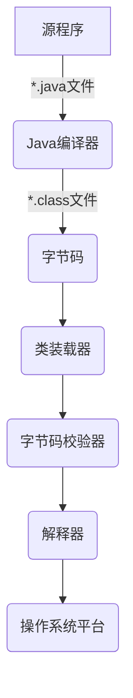

# 注解和反射
# 注解

## 什么是注解

- Annotation是从JDK5.0引入的新技术
- Annotation的作用
  - 不是程序本身，可以对程序作出解释(这一点和注释comment没什么区别)
  - **可以被其他程序（比如编译器等）读取**
- Annotation的格式：
  - 注释是以"@注释名"在代码中存在的，还可以添加一些参数值，例如：`@SuppressWarnings(value="unchecked")` -> 不显示异常
- Annotation在哪里使用？
  - 可以附加在package，class，method，field等上面，相当于给他们添加了额外的辅助信息，我们可以通过反射机制变成实现对这些元数据的访问

## 注解案例

```java
// 什么是注解

public class Test01 extend Object{
    
    // Override 重写的注解
    @Override
    public String toString(){
        return super,toString();
    }
    
    // Deprecated 该注解说明这个方法不推荐使用，但是可以使用，或者存在更好的方式
    @Deprecated
    public static void test(){
        System.out,println("Deprecated");
    }
    
    public static void main(String[] args){
        // 因为上面注释了test方法为Deprecated，所以在编译器中，下面这行代码会有条线划过
        test();
    }
    
    // SupperessWarings 压住所有异常 所以下面在创建数组的使用不会警告说给出初始大小
    @SuppressWarnings("all")
    public void test02(){
        List list = new ArrayList();
    }
    
}
```

## 定义注解

```java
// 定义一个注解
// Target 表示我们的注解可以用在哪些地方
@Target(value = {ElementType.METHOD,ElementType.TYPE})

// Retention(中译：保存) 表示我们的注解在什么地方还有效
@Retention(value = RetentionPolicy.RUNTIME)

// Documented 表示是否将我们的注解生成在JavaDoc中
@Documented

// Inherited 允许子类可以继承父类的注解 
@Inherited
@interface MyAnnotation{
    
    // 这里的小括号不是方法，是变量
    String name() default "";
    int age();
    int id() default -1; // 如果默认值为-1，表示不存在
    String [] schools() default {"hello","world"};
}
```

## 注解的使用

```java
// 注解可以显示复制，如果没有默认值，我们就必须给注解赋值
// 当要输入的变量只有一个时，可设为value，这样传参数的时候不需要写变量名
@MyAnnotation(age = 18, name = "Heachy")
public void test(){
    
}
```

# 反射

## 什么是反射

反射是Java中的一种机制，允许程序在运行时获取类的信息（如方法、字段、构造函数等）并动态调用。通过反射，程序可以在编译时未知的情况下加载类、创建对象、访问属性和方法。

```java
public class Test02{
    public static void main(String[] args){
        // 通过反射获取类的Class对象
        Class c1 = Class.forName("com.cy.learn.User"); // 类的全称
        
        Class c2 = Class.forName("com.cy.learn.User");
        Class c3 = Class.forName("com.cy.learn.User");
        Class c4 = Class.forName("com.cy.learn.User");
        
        // 一个类在内存中只有一个Class对象
        // 一个类被加载后，类的整个结构都会被封装在Class对象中
        // 所以三个hash值一致
        System.out.println(c2.hashCode());
        System.out.println(c3.hashCode());
        System.out.println(c4.hashCode());
    }
}

Class User{...}
```

## 通过反射获取类

- 若已知具体的类，通过类的class属性获取，该方法最为安全可靠，程序性能性最高

​		`Class clazz = Person.class;`

- 已知某个类的实例，调用该实例的getClass()方法获取Class对象

​		`Class clazz = person.getClass();`

- 已知一个类的全类名，且该类在该类路径下，可通过CLass类的静态方法forName()获取，可能抛出ClassNotFoundException

  `CLass clazz = Class.forName("com.cy.learn.Person");`

- 内置基本数据类型可以用`类名.TYPE`

  `Class clazz = Integer.TYPE;`

- 可通过getSuperclass()获取父类类型

  `Class clazz = person.getSuperclass();`

- 还可以利用ClassLoader类加载器

## 反射获取类中信息

```java
public class Test08{
    public static void main(String[] args) throws ClassNotFountException{
        Class user = Class.forName("com.cy.learn.User");
        
        // 获取类的名字   
        // 包名 + 类名
        user.getName();
        // 类名
        user.getSimpleName();
        
        // 获取类的属性   只能获得public属性
        Field[] fields = user.getFields();
        // 获得全部属性
        fields = user.getDeclaredFields();
        
        // 获得指定属性的值
        Field name = user.getDeclaredField("name");
        
        // 获得类的方法   只能获得本类及父类的全部public方法
        Method[] methods = user.getMethods();
        // 获得本类的所有方法
        method = user.getDeclareMethods();
        
        // 获得指定方法  重载 根据传入的参数数量和类型获取对应的方法
        Method getName = user.getMethod("getName",null);
        Method setName = user.getMethod("setName",String.class);
        
        // 同样还有获取构造器 把上面调用的方法名中对应部分改为constructor
    }
}
```

## 反射调用方法

```java
public class Test09{
    public static void main(String[] args) throws ClassNotFountException{
        // 获取class对象
        Class user = Class.forName("com.cy.learn.User");
        
        // 反射构造对象
        User newUser = (User)user.newInstance(); // 本质是调用无参构造器
        // 带参构造器
        Constructor constructor = user.getDeclaredConstructor(String.class,int.class,int.class);
        newUser = (User) constructor,newInstance("张三"，001,18);
        
        // 调用普通方法
        Method setName = user.getDeclaredMethod("setName",String.class);
        // invoke: 激活的意思    (对象, "方法的值")
        setName.invoke(newUser,"Heachy");
        
        // 通过反射操作属性
        Field name = user.getDeclaredField("name");
        
        // 不能直接操作私有属性，我们需要关闭程序的安全监测，属性或者方法的setAccessible(true)
        name.setAccessible(true);
        name.set(newUser,"新名字");
        
        // 还可以获取函数的泛型类型信息
        // 传参泛型
        Type[] genericParameterType = method.getGenericParameterType();
        // 返回泛型
        Type genericReturnType = method.getGenericReturnType();
    }
}
```

- Method和Field、Constructor对象都有setAccessible()方法
- setAccessible作用是启动和禁用访问安全检查的开关
- 参数值为true则指示反射的对象在使用时取消Java语言访问检查
  - 提高反射的效率。如果代码中必须使用反射，而该句代码需要频繁的被调用，那么请设置为true
  - 使得原本无法访问的私有成员也可以访问
- 参数值为false则指示反射的对象应该实施Java语言访问检查

## 类加载器的作用

- 类加载的作用：将class文件字节码加载到内存中，并将这些静态数据转换成方法区的运行时数据结构，然后再堆中生成一个代表这个类的java.class.Class对象，作为方法区中类数据的访问入口
- 类缓存：标准的JavaSE类加载器可以按要求查找类，但一旦某个类被加载到类加载器中，它将维持加载(缓存)一段时间。不过JVM垃圾回收机制可以回收这些class对象



## 发生类初始化的时刻

- 类的主动引用（一定会发生类的初始化）
  - 当虚拟机启动，先初始化main方法所在的类
  - new一个类的对象
  - 调用类的静态成员（除了final常量）和静态方法
  - 使用java.lang.reflect包的方法对类进行反射调用
  - 当初始化一个类，如果其父类没有被初始化，则会初始化它的父类
- 类的被动引用（不会发生类的初始化）
  - 当访问一个静态域时，只有真正声明这个域的类才会被初始化。如：当通过子类引用父类的静态变量，不会导致子类初始化
  - 通过数组定义类引用，不会触发此类的初始化
  - 引用常量不会触发此类的初始化（常量在链接阶段就存入调用类的常量池中了）

```java
public class Test07{
    public static void main(String[] args) throws ClassNotFountException{
        // 获取系统类的加载器
        ClassLoader systemClassLoader = ClassLoader.getSystemClassLoader();
        
        // 获取系统类加载器的父类加载器 --> 扩展类加载器
        ClassLoader extParent = systemClassLoader.getParent();
        
        // 获取扩展类加载器的父类加载器 --> 根加载器（c/c++）
        ClassLoader rootParent = extParent.getParent();
        
        // 测试当前类是哪个加载器加载的
        ClassLoader classLoader = Class.forName("com.cy.learn.Test07").getClassLoader();
        
        // 测试JDK内置的类是谁加载的
        CLassLoader inerClassLoader = Class.forName("java.lang.Object").getClassLoader();
    }
}
```

## 类加载器的作用

>  类加载器的作用是用来把类（class）装载进内存的。JVM规范定义了如下类型的类的加载器

- **引导类加载器：**用C++编写的，是JVM自带的类加载器，**负责Java平台核心库**，用来装载核心类库。该加载器无法直接获取
- **扩展类加载库：**负责jre/lib/ext目录下的jar包或`-D java.ext.dirs`指定目录下的jar包装入工作库
- **系统类加载器：**负责`java -classpath`或`-D java.ext.dirs`所指的目录下的类与jar包装入工作，是最常用的加载器

-----------------------------------------------自底向上检查类是否已加载---------------------------------------->

自定义类加载器---System ClassLoader---Extension ClassLoader--- Bootstrap ClassLoader

<-------------------------------------------------自顶向下尝试加载类------------------------------------------------

## 类加载和ClassLoader

- **加载：**将class文件字节码加载到内存中，并将这些静态数据转换成方法区的运行时数据结构，然后再堆中生成一个代表这个类的java.class.Class对象，作为方法区中类数据的访问入口
- **链接：**将java类的二进制代码合并到JVM的运行状态之中的过程
  - 验证：确保加载的类信息符合JVM规范，没有安全方面的问题
  - 准备：正式为类变量(static)分配内存并设置类变量默认初始值的阶段，这些内存都将在方法区中进行分配。
  - 解析：虚拟机常量池内的符号引用（常量名）替换为直接引用（地址）的过程
- **初始化：**
  - 执行类构造器`<clinit>()`方法的过程。类构造器`<clinit>()`方法是由编译期自动收集类中所有类变量的赋值动作和静态代码块中的语句合并产生的。（类构造器是构造类信息的，不是构造该类对象的构造器）
  - 当初始化一个类的时候，如果发现其父类还没有进行初始化，则需要先触发其父类的初始化
  - 虚拟机会保证一个类的`<clinit>()`方法再多线程环境中被正确加锁和同步