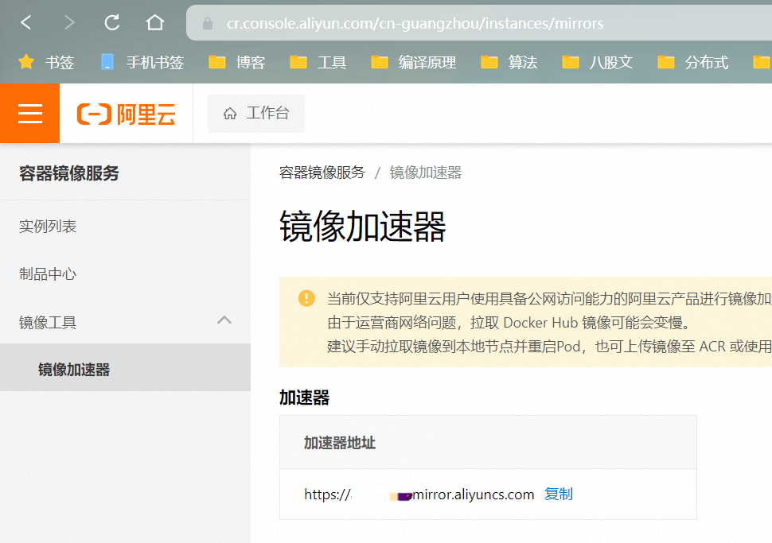
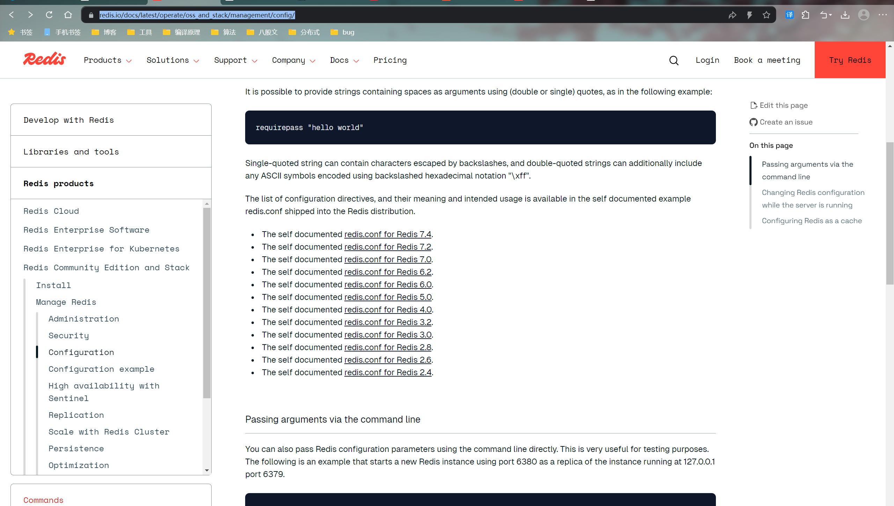

# docker容器
# 安装docker

[参考博客](https://blog.csdn.net/wodetongnian/article/details/140892857)

**在配置镜像仓库的时候，去阿里云控制台**

**配置文件**

```json
{
    "registry-mirrors": ["https://docker.m.daocloud.io",
        "https://huecker.io",
        "https://dockerhub.timeweb.cloud",
        "https://noohub.ru","https://apee3cbt.mirror.aliyuncs.com"],
    "dns": ["8.8.8.8","8.8.4.4"]
}
```



# 安装汉化版portainer

[相关博客](https://blog.csdn.net/weixin_58159207/article/details/141556765)

**注意9000端口是旧版的，末尾有-ce的是新版**

默认情况下，Portainer Server 将通过 port9443公开UI 并通过 port公开 TCP 隧道服务器8000

# 删除相关命令

[参考博客](https://blog.csdn.net/qq_41322460/article/details/132301348)

# 启动报错

> 并不是指特定的解决方案，实际问题根据日志去解决

```cmd
[root@heachy ~]# systemctl start docker
Job for docker.service failed because the control process exited with error code.
See "systemctl status docker.service" and "journalctl -xe" for details.
```

然后通过`systemctl status docker.service`查看docker服务的状态，不过报错一般是红点

**解决方法**

- 先查看日志

  ```cmd
  tail -200f /var/log/messages  # 查看系统日志尾部200行
  ```

- 这次的bug

  ```cmd
  Oct 25 10:37:07 heachy dockerd[125621]: failed to start daemon: Error initializing network controller: error creating default "bridge" network: cannot create network 89014cb5e63ddecd58271828684f2da4b471b19d53b6f35693afb22f84190cb9 (docker0): conflicts with network a7af3e898557f22e955d45d4d91cc67e44d7f9047132d65de35eb8e13d4b9842 (docker0): networks have same bridge name
  Oct 25 10:37:07 heachy systemd[1]: docker.service: Main process exited, code=exited, status=1/FAILURE
  Oct 25 10:37:07 heachy systemd[1]: docker.service: Failed with result 'exit-code'.
  ```

- 解决

  ```cmd
  # 先关闭防火墙
  systemctl stop firewalld
  systemctl disable firewalld
  
  # 删除/var/lib/docker/network/下的文件files
  cd /var/lib/docker/network/
  rm -rf files
  
  # 重启docker即可
  systemctl restart docker
  ```

**什么时区bug**

```bash
ERROR: ZONE_CONFLICT: 'docker0' already bound to a zone Nov 19 11:18:11 heachy dockerd[508570]: time="2024-11-19T11:18:11.931184341+08:00" level=info msg="stopping event stream following graceful shutdown" error="<nil>" module=libcontainerd namespace=moby
```

解决方法

1. 检查firewall-cmd中是否存在docker zone 

```bash
 firewall-cmd --get-active-zones
```

2 .如果“docker”区域可用，将接口更改为 docker0（非持久化）

```bash
sudo firewall-cmd --zone=docker --change-interface=docker0
```

3.如果“docker”区域可用，请将接口更改为 docker0（持久化）

```bash
sudo firewall-cmd --permanent --zone=docker --change-interface=docker0 

sudo systemctl restart firewalld
```

4 启动docker 

```bash
systemctl  start  docker
```

# docker 安装redis

[参考博客](https://www.cnblogs.com/qianmo123/p/17661084.html)

redis[下载配置文件路径](https://redis.io/docs/latest/operate/oss_and_stack/management/config/)

往下滑即可看到

**查看lates的版本号**

`docker image inspect redis:latest | grep -i version`

启动命令

```cmd
docker run -it --restart=always --privileged=true --name redis_6379 -p 6379:6379 -v /www/env/docker/redis/conf/redis.conf:/etc/redis/redis.conf -v /www/env/docker/redis/data:/data -v /www/env/docker/redis/log/redis.log:/var/log/redis.log -d redis:7.4 /etc/redis/redis.conf
```

**进入容器空间**

`docker exec -it redis_6379 /bin/bash`

**退出**

`ctrl d`

# docker安装rabbitMq

> [参考博客](https://blog.csdn.net/qq_17847881/article/details/142867746)

**安装指令**

```bash
docker pull rabbitmq
```

**运行指令**

```bash
docker run -d -p 15672:15672 -p 5672:5672 \
        --restart=always \
        -e RABBITMQ_DEFAULT_VHOST=my_vhost  \
        -e RABBITMQ_DEFAULT_USER=admin \
        -e RABBITMQ_DEFAULT_PASS=147258.chyi \
        --hostname myRabbit \
        --name rabbitmq-new\
        rabbitmq:latest

# 参数说明：
# -d：表示在后台运行容器；
# -p：将主机的端口 15673（Web访问端口号）对应当前rabbitmq容器中的 15672 端口，将主机的5674（应用访问端口）端口映射到# # rabbitmq中的5672端口；
# --restart=alawys：设置开机自启动
# -e：指定环境变量：
#     RABBITMQ_DEFAULT_VHOST：默认虚拟机名；
#     RABBITMQ_DEFAULT_USER：默认的用户名；
#     RABBITMQ_DEFAULT_PASS：默认的用户密码；
# --hostname：指定主机名（RabbitMQ 的一个重要注意事项是它根据所谓的 节点名称 存储数据，默认为主机名）；
# --name rabbitmq-new：设置容器名称；

```

**启动rabbitmq访问的web客户端**

```bash
# 1. 进入rabbitmq容器
docker exec -it 容器名/容器id /bin/bash
# 2. 开启web客户端
rabbitmq-plugins enable rabbitmq_management
```


# DockerFile

```bash
# 镜像java版本，这里有坑，你可以看着项目里的pom.xml文件确定自己的版本，如果有问题的话多尝试几个
FROM java:17
# VOLUME 指定了临时文件(使用容器卷)目录为/tmp,在主机/var/lib/docker目录下创建了一个临时文件并链接到容器的/tmp。
VOLUME /tmp
# 将jar包添加到容器中并更名为test2.jar
ADD helloworld-0.0.1-SNAPSHOT.jar helloworld.jar
# 暴露端口号
EXPOSE 8082
# 容器启动时会运行的命令
ENTRYPOINT ["java","-jar","/helloworld.jar"]
```


