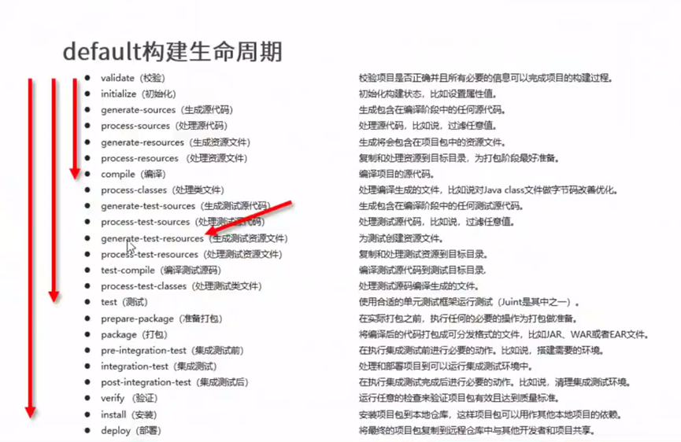

# Maven

# Pom.xml代码示例

1. 例行开头到版本 4.0.0
2. 这个 Maven 项目的坐标
3. JUnit 的依赖项

```xml
<?xml version="1.0" encoding="UTF-8"?>
<project xmlns="http://maven.apache.org/POM/4.0.0" xmlns:xsi="http://www.w3.org/2001/XMLSchema-instance"
         xsi:schemaLocation="http://maven.apache.org/POM/4.0.0 http://maven.apache.org/xsd/maven-4.0.0.xsd">
    <modelVersion>4.0.0</modelVersion>
    <groupId>org.example</groupId>
    <artifactId>untitled</artifactId>
    <version>1.0-SNAPSHOT</version>
    <dependencies>
        <dependency>
            <groupId>junit</groupId>
            <artifactId>junit</artifactId>
            <version>4.11</version>
            <scope>test</scope>
        </dependency>
    </dependencies>
</project>
```

# 依赖范围

- 依赖的jar默认情况可以在任何地方使用，可以通过scope标签设定其作用范围

**作用范围**
- 主程序范围有效（main文件夹范围内）
- 测试程序范围有效（test文件夹范围内）
- 是否参与打包（package指令范围内）

| scope         | 主代码 | 测试代码 | 打包 | 范例        |
| ------------- | ------ | -------- | ---- | ----------- |
| compile(默认) | Y      | Y        | Y    | log4j       |
| test          |        | Y        |      | junit       |
| provided      | Y      | Y        |      | servlet-api |
| runtime       |        |          | Y    | jdbc        |

在这个Markdown表格中，"Y" 表示该依赖在相应的作用范围内是有效的，空格表示无效，"-" 表示不适用或无此选项。

## 依赖范围传递性

带有依赖范围的资源在进行传递时，作用范围将受到影响。

|          | compile | test | provided | runtime |
| -------- | ------- | ---- | -------- | ------- |
| compile  | compile | test | provided | runtime |
| test     |         |      |          |         |
| provided |         |      |          |         |
| runtime  | runtime | test | provided | runtime |

在这个Markdown表格中，空白单元格表示在该依赖范围组合下没有传递性，即依赖不会被传递。例如，如果一个`compile`范围的依赖被另一个`compile`范围的依赖所依赖，那么这个依赖将保持`compile`范围。如果一个`runtime`范围的依赖被一个`test`范围的依赖所依赖，那么这个依赖的范围将变为`test`。表格中的"直接依赖"和"间接依赖"是图片中的注释，用于说明表格的内容。

* 直接依赖
* 间接依赖

# 生命周期

