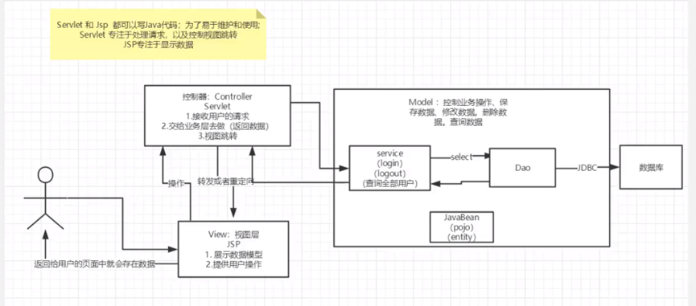
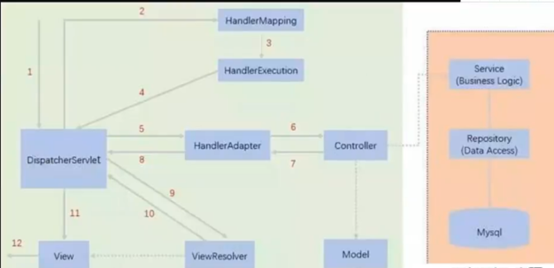

# SpringMVC

# 服务端与客户端流程



# 代码实例示例

## 错误的servelet

```java
public class helloServlet extends HttpServlet {
    @Override
    protected void doGet(HttpServletRequest req, HttpServletResponse resp) {
        super.doGet(req, resp);
        String method = req.getParameter("method");
    }
}
```

### 错误信息

#### HTTP状态 500 - 内部服务器错误

**类型**: 异常报告

**消息**: 提交响应后无法转发

**描述**: 服务器遇到一个意外的情况，阻止它完成请求。

#### 例外情况

```text
java.lang.IllegalStateException: 提交响应后无法转发
    at com.cy.servlet.helloServlet.doGet(helloServlet.java:23)
    at com.cy.servlet.helloServlet.doPost(helloServlet.java:29)
    at jakarta.servlet.http.HttpServlet.service(HttpServlet.java:694)
    at jakarta.servlet.http.HttpServlet.service(HttpServlet.java:777)
```

#### 解决建议

- 确保在调用 `super.doGet(req, resp);` 后不再进行请求的转发或包含操作。

# Spring MVC请求执行流程



# Spring MVC 请求处理流程示例

## 执行流程

1. 首先根据传入的域名做解析，例如访问 `http://localhost:8080/hello`。

### Handler 配置

```xml
<!-- Handler配置 -->
<bean id="/hello" class="com.cy.controller.HelloController"/>
```

2. DispatcherServlet 回去寻找 bean 容器里的 `/hello`。

3. 然后去找对应的控制器 `HelloController`。

### HelloController 控制器

```java
public class HelloController implements Controller {
    public ModelAndView handleRequest(HttpServletRequest request, HttpServletResponse response) throws Exception {
        // ModelAndView 模型和视图
        ModelAndView mv = new ModelAndView();
        // 封装对象，放在 ModelAndView 中。Model
        mv.addObject("msg", "HelloSpringMVC!");
        // 封装要跳转的视图，放在 ModelAndView 中
        mv.setViewName("hello"); // 指向 /WEB-INF/jsp/hello.jsp
        return mv;
    }
}
```

4. 在 `HelloController` 中将想要传给前端的数据塞进去，并告知要跳转到 `hello.jsp` 的视图。

### 视图 hello.jsp

5. DispatcherServlet 会去拼接 `hello.jsp` 的路径。

6. 最终将视图返回给客户端。

# Spring-Servlet.xml 的配置

```xml
<?xml version="1.0" encoding="UTF-8"?>
<beans xmlns="http://www.springframework.org/schema/beans"
       xmlns:xsi="http://www.w3.org/2001/XMLSchema-instance"
       xmlns:context="http://www.springframework.org/schema/context"
       xmlns:mvc="http://www.springframework.org/schema/mvc"
       xsi:schemaLocation="http://www.springframework.org/schema/beans
                           http://www.springframework.org/schema/beans/spring-beans.xsd
                           http://www.springframework.org/schema/context
                           http://www.springframework.org/schema/context/spring-context.xsd
                           http://www.springframework.org/schema/mvc
                           http://www.springframework.org/schema/mvc/spring-mvc.xsd">

    <!-- 自动扫描包，让指定包下的注解生效，由IOC容器统一管理 -->
    <context:component-scan base-package="com.cy.controller"/>

    <!-- 让Spring MVC不处理静态资源 -->
    <mvc:default-servlet-handler/>

    <!-- 支持mvc注解驱动 -->
    <!-- 在spring中一般采用RequestMapping注解来完成映射关系 -->
    <!-- 要想使RequestMapping注解生效，必须向上下文中注册DefaultAnnotationHandlerMapping -->
    <!-- 和一个AnnotationMethodHandlerAdapter实例 -->
    <!-- 这两个实例分别在类级别和方法级别处理。而annotation-driven配置帮助我们自动完成上述两个实例的注入。 -->
    <mvc:annotation-driven/>

    <!-- 视图解析器 -->
    <bean class="org.springframework.web.servlet.view.InternalResourceViewResolver"
          id="internalResourceViewResolver">
        <!-- 前缀 -->
        <property name="prefix" value="/WEB-INF/jsp/"/>
        <!-- 后缀 -->
        <property name="suffix" value=".jsp"/>
    </bean>

</beans>
```

## 配置说明

- **组件扫描**：`<context:component-scan base-package="com.cy.controller"/>` 用于自动扫描指定包下的注解，由Spring的IOC容器进行管理。
- **默认Servlet处理器**：`<mvc:default-servlet-handler/>` 用于处理静态资源。
- **注解驱动**：`<mvc:annotation-driven/>` 启用Spring MVC的注解功能，如`@RequestMapping`。
- **视图解析器**：`<bean class="org.springframework.web.servlet.view.InternalResourceViewResolver" id="internalResourceViewResolver">` 用于解析JSP视图，其中`prefix`和`suffix`属性分别指定了JSP文件的路径前缀和后缀。

# Web.xml 的配置

```xml
<?xml version="1.0" encoding="UTF-8"?>
<web-app xmlns="https://jakarta.ee/xml/ns/jakartaee"
         xmlns:xsi="http://www.w3.org/2001/XMLSchema-instance"
         xsi:schemaLocation="https://jakarta.ee/xml/ns/jakartaee https://jakarta.ee/xml/ns/jakartaee/web-app_5_0.xsd"
         version="5.0">

    <!-- 1. 注册servlet -->
    <servlet>
        <servlet-name>SpringMVC</servlet-name>
        <servlet-class>org.springframework.web.servlet.DispatcherServlet</servlet-class>
        <!-- 通过初始化参数指定SpringMVC配置文件的位置，进行关联 -->
        <init-param>
            <param-name>contextConfigLocation</param-name>
            <param-value>classpath:springmvc-servlet.xml</param-value>
        </init-param>
        <!-- 启动顺序，数字越小，启动越早 -->
        <load-on-startup>1</load-on-startup>
    </servlet>

    <!-- 所有请求都会被SpringMVC拦截 -->
    <servlet-mapping>
        <servlet-name>SpringMVC</servlet-name>
        <url-pattern>/</url-pattern>
    </servlet-mapping>

</web-app>
```

## 配置说明

- **servlet 名称**：`SpringMVC`，用于在 web 应用中标识这个 servlet。
- **servlet 类**：`org.springframework.web.servlet.DispatcherServlet`，Spring MVC 的前端控制器。
- **初始化参数**：`contextConfigLocation` 指定了 Spring MVC 的配置文件位置，`classpath:springmvc-servlet.xml` 表示配置文件位于类路径下。
- **启动顺序**：`<load-on-startup>1</load-on-startup>` 表示这个 servlet 在应用启动时的加载顺序，数字越小，加载越早。
- **servlet 映射**：`<url-pattern>/</url-pattern>` 表示所有请求都会通过这个 servlet 处理。

# RestFul Controller 示例

## 原来的请求路径风格
原来的请求路径使用查询参数来传递数据：  `http://localhost:8080/add?a=1&b=2`

## RestFul 请求路径风格
使用 RestFul 风格的请求路径，将参数直接放在 URL 路径中：  `http://localhost:8080/add/1/2`

## Controller 代码示例

```java
@Controller
public class RestFulController {

    // 映射到 http://localhost:8080/add/1/3
    @GetMapping("/add/{a}/{b}")
    public String test1(@PathVariable int a, @PathVariable String b, Model model) {
        String res = a + b; // 注意：这里直接连接字符串，如果b是数字类型，需要转换
        model.addAttribute("msg", "结果1为" + res);
        return "test";
    }
}
```

## 说明

- 使用 `@GetMapping` 注解映射 HTTP GET 请求到特定的处理方法。
- `@PathVariable` 注解用于获取 URL 路径中的变量。
- `Model` 用于向视图传递数据。

# 通过SpringMVC实现转发和重定向

## 说明

> 转发就是url不发生改变，重定向就是会发生改变

- **重定向**：不需要视图解析器，本质是重新请求一个新地方，需要注意路径问题。
- **转发**：可以重定向到另一个请求实现。

## Controller 示例

```java
@Controller
public class ResultspringMVC2 {

    @RequestMapping("/rsm2/t1")
    public String test1() {
        // 转发
        return "test";
    }

    @RequestMapping("/rsm2/t2")
    public String test2() {
        // 重定向
        return "redirect:/index.jsp"; // 重定向到 index.jsp 页面
        // return "redirect:hello.do"; // 重定向到 hello.do 请求
    }
}
```

## 路径注意事项

- 当使用重定向时，确保路径正确，以便正确地跳转到目标页面或请求。
- `redirect:/index.jsp` 表示重定向到当前应用下的 `index.jsp` 页面。
- `redirect:hello.do` 表示重定向到当前应用下的 `hello.do` 请求，这通常对应于另一个控制器方法。

# Spring 自带等待过滤器配置

## 过滤器配置

```xml
<filter>
    <filter-name>encoding</filter-name>
    <filter-class>org.springframework.web.filter.CharacterEncodingFilter</filter-class>
    <init-param>
        <param-name>encoding</param-name>
        <param-value>utf-8</param-value>
    </init-param>
</filter>
<filter-mapping>
    <filter-name>encoding</filter-name>
    <url-pattern>/*</url-pattern>
</filter-mapping>
```

## 说明

- **filter-name**：定义过滤器的名称，这里为 `encoding`。
- **filter-class**：指定过滤器的类，这里使用的是 Spring 提供的 `CharacterEncodingFilter`，用于解决字符编码问题。
- **init-param**：初始化参数，这里设置了字符编码为 `utf-8`。
- **filter-mapping**：将过滤器映射到 URL 模式，这里使用 `url-pattern` `/*` 表示对所有请求应用此过滤器。

## 使用场景

- Spring 自带的 `CharacterEncodingFilter` 过滤器在大部分情况下足够使用，特别是在处理字符编码问题时。

# JsonUtils 类

## 方法一：默认日期格式的 JSON 转换

```java
public class JsonUtils {
    public static String getJson(Object object){
        return getJson(object, "yyyy-MM-dd HH:mm:ss");
    }
}
```

## 方法二：自定义日期格式的 JSON 转换

```java
public class JsonUtils {
    public static String getJson(Object object, String dateFormat){
        ObjectMapper mapper = new ObjectMapper();
        // 不使用时间戳的方式
        mapper.configure(SerializationFeature.WRITE_DATES_AS_TIMESTAMPS, false);
        // 自定义日期的格式
        SimpleDateFormat sdf = new SimpleDateFormat(dateFormat);
        mapper.setDateFormat(sdf);

        try {
            return mapper.writeValueAsString(object);
        } catch (JsonProcessingException e) {
            e.printStackTrace();
        }
        return null;
    }
}
```

## 说明

- `JsonUtils` 类提供了两个静态方法用于将对象转换为 JSON 字符串。
- 第一个方法 `getJson(Object object)` 使用默认的日期格式 `"yyyy-MM-dd HH:mm:ss"`。
- 第二个方法 `getJson(Object object, String dateFormat)` 允许用户自定义日期格式。
- 使用 `ObjectMapper` 进行 JSON 序列化，并设置日期格式。
- 如果序列化过程中发生异常，将打印堆栈跟踪并返回 `null`。

## 设计思想

- 方法重载的一种思想，不需要写重复代码，没有参数就传递一个默认值。